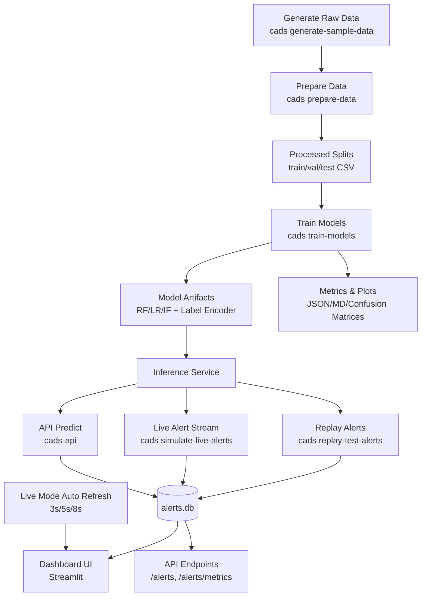

# Cyber Attack Detection System

This repo builds a full cyber attack detection workflow:
- creates/ingests network traffic data
- trains ML models to detect suspicious behavior
- runs inference and stores alerts in a local database
- exposes API endpoints for predictions and alert retrieval
- provides an interactive dashboard for monitoring and investigation

## Workflow


## Commands
- `uv sync --extra dev` -> install project dependencies
- `uv run cads generate-sample-data --rows 5000 --seed 42` -> create synthetic raw traffic dataset
- `uv run cads prepare-data` -> clean data, engineer features, create train/val/test splits
- `uv run cads train-models` -> train models and save metrics/plots/artifacts
- `uv run cads replay-test-alerts --limit 300 --mode <mode>` -> run inference on test rows and store alerts in DB
- `uv run cads simulate-live-alerts --interval 5 --batch-size 3 --cycles 60 --mode single` -> stream fresh alerts every few seconds for live dashboard movement
- `uv run cads-api` -> start FastAPI backend
- `uv run streamlit run src/cads/dashboard/app.py` -> start dashboard UI
- `uv run pytest -q` -> run tests
- `uv run python scripts/perf_benchmark.py` -> generate latency benchmark report

## 1) Install
```bash
uv sync --extra dev
```

## 2) Build Data + Train Models
```bash
uv run cads generate-sample-data --rows 5000 --seed 42
uv run cads prepare-data
uv run cads train-models
```

## 3) Generate Alerts for UI
```bash
uv run cads replay-test-alerts --limit 300
```

Modes:
```bash
# single -> use best supervised model only (fastest, clean default)
uv run cads replay-test-alerts --limit 300 --mode single

# compare_all -> run logistic + random_forest + isolation_forest and keep model breakdown
uv run cads replay-test-alerts --limit 300 --mode compare_all

# ensemble -> combine best supervised + anomaly signal for final decision
uv run cads replay-test-alerts --limit 300 --mode ensemble
```

## 4) Start API
```bash
uv run cads-api
```

API docs:
- `http://localhost:8000/docs`

`/predict` also supports:
- `?mode=single`
- `?mode=compare_all`
- `?mode=ensemble`

## 5) Start Dashboard
```bash
uv run streamlit run src/cads/dashboard/app.py
```

Dashboard:
- `http://localhost:8501`
- Use `Live Mode` toggle in dashboard for auto-refresh (3s/5s/8s/etc).

## Real-Time Demo Mode
Run this in a separate terminal while dashboard is open:
```bash
# single -> best supervised model only
uv run cads simulate-live-alerts --interval 5 --batch-size 3 --cycles 60 --mode single

# compare_all -> runs all models and stores model breakdown in evidence
uv run cads simulate-live-alerts --interval 5 --batch-size 3 --cycles 60 --mode compare_all

# ensemble -> combines supervised + anomaly signal
uv run cads simulate-live-alerts --interval 5 --batch-size 3 --cycles 60 --mode ensemble
```
This inserts new alerts continuously, so charts and counts keep changing in real time.
Note: it stops after `--cycles` completes. For longer runs, increase `--cycles`.

## 6) Test
```bash
uv run pytest -q
```

## 7) Optional Performance Check
```bash
uv run python scripts/perf_benchmark.py
```

## Deploy on Render (Dashboard URL)
1. Push this repo to GitHub.
2. In Render: **New + -> Blueprint**.
3. Select this repo (Render reads `render.yaml`).
4. Deploy and open generated service URL.

Notes:
- Service runs dashboard + live simulator together.
- Live behavior is controlled by env vars:
  - `CADS_LIVE_MODE` (`single`/`compare_all`/`ensemble`)
  - `CADS_LIVE_INTERVAL` (seconds)
  - `CADS_LIVE_BATCH_SIZE`
  - `CADS_LIVE_CYCLES`

## Quick Notes
- If dashboard is empty, run replay command again.
- If API says model missing, run training again.
- Main runtime files are under `src/cads/`.
- `--limit 300` in replay means "insert 300 in this run", not "cap total alerts at 300".
- Dashboard total may be higher because alerts are cumulative in `artifacts/reports/alerts.db` (older replay runs + API calls).
- To start fresh:
```bash
rm artifacts/reports/alerts.db
uv run cads replay-test-alerts --limit 300 --mode single
```
